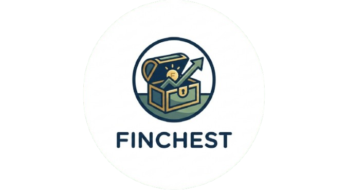

# Finchest - Your Personal Finance Chest

A personal expense and savings tracker with **offline-first PWA**, **TOTP 2FA authentication**, and **beautiful dark theme**.



## 🏗️ Architecture

```
┌─────────────────────────┐     ┌─────────────────────────┐
│   Vercel (Frontend)     │────▶│   Render (Backend)      │
│   Next.js App           │     │   Flask API + TOTP 2FA  │
│   Always Available      │     │   Free Tier (sleeps)    │
└─────────────────────────┘     └─────────────────────────┘
         │                                   │
         ▼                                   ▼
   ┌───────────┐                    ┌───────────────┐
   │ IndexedDB │                    │ MongoDB Atlas │
   │ (Offline) │                    │   (Database)  │
   └───────────┘                    └───────────────┘
```

## ✨ Features

- **🔐 TOTP 2FA**: Secure login with Google/Microsoft Authenticator
- **🚀 Instant Loading**: Cached data shows immediately, API updates in background
- **📱 PWA Support**: Install on mobile home screen with app icon
- **📴 Offline Mode**: Add entries offline, auto-sync when connected
- **💰 Monthly Totals Caching**: View spending even when offline
- **🌙 Dark Theme**: Navy blue and teal theme matching the Finchest brand
- **📊 Reports**: Filter by category, payment mode, date range
- **🇮🇳 IST Timezone**: All timestamps in Indian Standard Time

## 🚀 Quick Start

### Backend (Flask API)

```bash
# Install dependencies
pip install -r requirements.txt

# Set environment variables in .env
MONGO_URI=your_mongodb_uri
AUTH_USERNAME=your_username
AUTH_PASSWORD=your_secure_password
JWT_SECRET=your_jwt_secret
TOTP_SECRET=your_totp_secret  # Generate with: python -c "import pyotp; print(pyotp.random_base32())"
FRONTEND_URL=http://localhost:3000

# Run
python app.py
```

### Frontend (Next.js)

```bash
cd frontend

# Install dependencies
npm install

# Set API URL in .env.local
NEXT_PUBLIC_API_URL=http://localhost:5000

# Run
npm run dev
```

## 📦 Deployment

### Backend → Render

1. Create a new Web Service on [Render](https://render.com)
2. Connect your GitHub repo
3. Set environment variables:
   - `MONGO_URI`
   - `AUTH_USERNAME`
   - `AUTH_PASSWORD`
   - `JWT_SECRET`
   - `TOTP_SECRET` (for 2FA - see setup below)
   - `FRONTEND_URL` (your Vercel URL)
4. Deploy

### Frontend → Vercel

1. Create a new project on [Vercel](https://vercel.com)
2. Import the `frontend/` directory
3. Set environment variable:
   - `NEXT_PUBLIC_API_URL` = your Render backend URL
4. Deploy

## 🔑 Authentication

### Credentials
Login credentials are set in the backend's `.env` file:

```env
AUTH_USERNAME=admin
AUTH_PASSWORD=your_secure_password
```

Sessions expire after **7 days**.

### TOTP 2FA Setup

1. Generate a TOTP secret:
   ```python
   import pyotp
   print(pyotp.random_base32())
   ```

2. Add to your `.env` or Render environment:
   ```env
   TOTP_SECRET=YOUR_GENERATED_SECRET
   ```

3. Setup your authenticator app:
   - Visit `https://your-backend-url/api/totp-setup` (requires login) to scan QR code
   - OR manually add in Google/Microsoft Authenticator:
     - **Account**: Finchest
     - **Secret**: (your TOTP_SECRET)
     - **Type**: Time-based

## 📁 Project Structure

```
finchest/
├── app.py              # Flask backend
├── api.py              # REST API with JWT + TOTP auth
├── config.py           # Backend config
├── requirements.txt    # Python dependencies
├── .env                # Backend secrets (not in git)
│
├── static/             # PWA assets
│   ├── logo.png        # Finchest logo
│   ├── icon-192.png    # PWA icon (192x192)
│   ├── icon-512.png    # PWA icon (512x512)
│   ├── manifest.json   # PWA manifest
│   ├── offline.js      # IndexedDB + offline support
│   └── sw.js           # Service worker
│
├── templates/          # Flask HTML templates
│
└── frontend/           # Next.js frontend
    ├── src/
    │   ├── app/        # Pages (login, expenses, savings)
    │   ├── components/ # React components
    │   ├── lib/        # API client, auth, offline
    │   └── types/      # TypeScript interfaces
    └── .env.local      # Frontend config (not in git)
```

## 🔧 API Endpoints

| Method | Endpoint | Auth | Description |
|--------|----------|------|-------------|
| POST | `/api/login` | ❌ | Login with username, password, TOTP code |
| GET | `/api/health` | ❌ | Health check |
| GET | `/api/totp-setup` | ✅ | Get QR code for authenticator setup |
| GET | `/api/verify` | ✅ | Verify token |
| GET | `/api/expenses` | ✅ | List expenses |
| POST | `/api/expenses` | ✅ | Add expense |
| PUT | `/api/expenses/:id` | ✅ | Update expense |
| DELETE | `/api/expenses/:id` | ✅ | Delete expense |
| GET | `/api/savings` | ✅ | List savings |
| POST | `/api/savings` | ✅ | Add saving |
| PUT | `/api/savings/:id` | ✅ | Update saving |
| DELETE | `/api/savings/:id` | ✅ | Delete saving |
| GET | `/api/stats` | ✅ | Get statistics |
| POST | `/api/sync` | ✅ | Bulk sync |

## 🔒 Security Notes

- **TOTP 2FA** required for all logins (Google/Microsoft Authenticator)
- JWT tokens stored in localStorage (expires in 7 days)
- Passwords are NOT hashed (single-user app with .env credentials)
- CORS configured to only allow your frontend origin
- For production, use HTTPS for both frontend and backend

## ⚡ Performance Features

- **Cache-first loading**: Reports show cached data instantly
- **Monthly totals caching**: View spending stats even offline
- **Background refresh**: API data fetched silently without blocking UI
- **2-second health check timeout**: Fast offline detection
- **Month-based cache expiry**: Auto-clears old data when month changes
- **IST timezone**: All timestamps in Indian Standard Time (UTC+5:30)

## 📱 PWA Installation

1. Open Finchest in Chrome/Safari on mobile
2. Tap "Add to Home Screen"
3. The Finchest logo will appear as your app icon
4. Launch like a native app!
